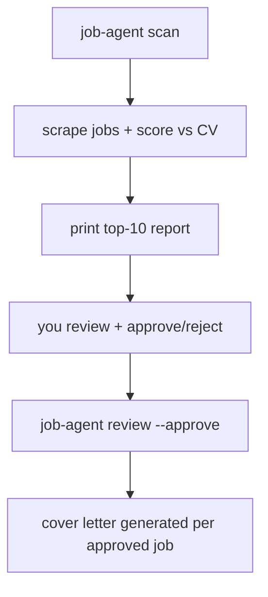

# job-application-agent

An agent that scrapes job boards, scores matches against your CV, and drafts tailored
cover letters for jobs you select.

## Workflow



Each run is identified by a `--thread-id`, so `scan` and `review` can be separate
CLI invocations. The workflow state (including the pending human-review step) is
checkpointed to `data/checkpoints.sqlite` in between.

## Setup

```bash
uv sync
cp .env.example .env   # fill in LLM_API_KEY, LLM_MODEL, etc.
```

Place your CV as a PDF somewhere accessible (e.g. `data/cv.pdf`), and create
your base cover letter template as either:
- `data/cover_letter.tex` (LaTeX format), or
- `data/cover_letter.txt` (plain text format)

The system auto-detects the format from the file extension.

## Usage

1. Scan a job board and print the top 10 matches:

   ```bash
   job-agent scan "machine learning engineer" "Munich, Germany" \
     --cv data/cv.pdf --thread-id ml-munich-2026-08-21
   ```

   Optional flags:
   - `--job-board` — which board to scrape (default `linkedin`).
   - `--experience-level` — repeatable, board-specific filter (e.g. `entry`,
     `mid-senior` for LinkedIn).
   - `--date-posted` — board-specific posting-age filter (`day`, `week`, `month`
     for LinkedIn).
   - `--pages-per-location` — result pages to fetch per location (default `1`).

2. Review the report saved in `data/reports`, then approve the jobs you want to apply to:

   ```bash
   job-agent review ml-munich-2026-08-21 \
     --reviewer "Liang Yu" \
     --approve "https://www.linkedin.com/jobs/view/123" \
     --approve "https://www.linkedin.com/jobs/view/456"
   ```

   Optional flags:
   - `--template` — path to cover letter template (default: `data/cover_letter.tex`).
     Supports `.tex` (LaTeX) or `.txt` (plain text) formats.

3. Tailored cover letters are written to `data/applications/<company-title>/cover_letter.{tex,txt}`
   (extension depends on template format).

### Just need one cover letter?

Skip the scan/review workflow entirely if you already know the job you want to apply to:

```bash
job-agent letter --cv data/cv.pdf --url "https://www.linkedin.com/jobs/view/123"
```

This fetches the job posting page, has the LLM extract the title/company/location/
description from it, and writes a tailored letter straight to
`data/applications/<company-title>/cover_letter.tex` (or `.txt` if using a plain text template).

Optional flags:
- `--template` — path to cover letter template (default: `data/cover_letter.tex`).
  Supports `.tex` (LaTeX) or `.txt` (plain text) formats.

To use a plain text template:

```bash
job-agent letter --cv data/cv.pdf --url "..." --template data/cover_letter.txt
```

Run `job-agent --help` or `job-agent <command> --help` for all options.
