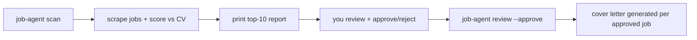

# job-application-agent

An agent that scrapes job boards, scores matches against your CV, and drafts tailored
cover letters — pausing for your approval before any letter is generated.

## Workflow



Each run is identified by a `--thread-id`, so `scan` and `review` can be separate
CLI invocations — the workflow state (including the pending human-review step) is
checkpointed to `data/checkpoints.sqlite` in between.

## Setup

```bash
uv sync
cp .env.example .env   # fill in LLM_API_KEY, LLM_MODEL, etc.
```

Place your CV as a PDF somewhere accessible (e.g. `data/cv.pdf`), and edit
`data/cover_letter.tex` to be your base cover letter template.

## Usage

1. Scan a job board and print the top 10 matches:

   ```bash
   job-agent scan "machine learning engineer" "Munich, Germany" \
     --cv data/cv.pdf --thread-id ml-munich-2026-08-21
   ```

2. Review the printed report, then approve the jobs you want to apply to:

   ```bash
   job-agent review ml-munich-2026-08-21 \
     --reviewer "Liang Yu" \
     --approve "https://www.linkedin.com/jobs/view/123" \
     --approve "https://www.linkedin.com/jobs/view/456"
   ```

3. Tailored cover letters are written to `data/applications/<company-title>/cover_letter.tex`.

Run `job-agent --help` or `job-agent <command> --help` for all options.
